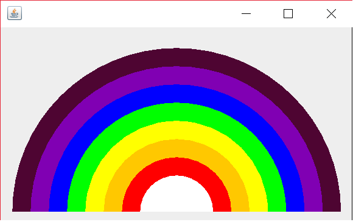

# Creating Rainbow in Java
## Combining Colors to make the sky rainbow pattern

[✔] Create two colors, INDIGO and VIOLET
[✔] Create array of colors and put ROY G. BIV plus two whites
[✔] In the constructor of Rainbow.java class, set background to WHITE
[✔] Create method paintComponent with Graphics object
    [✔] Create radius and set value of choice
    [✔] Get center of X
    [✔] Get center of Y
    [✔] Loop through colors
    [✔] Using object Graphics, setColor  to created colors with the loop - 1 to get last color
    [✔] Using object Graphics, fill the arc using fillArc method by setting the:-
        [✔] parameter x to center of X
        [✔] parameter y to center of Y
        [✔] parameter width to multiplicity of counter and radius double
        [✔] parameter height to multiplicity of counter and radius double
        [✔] parameter startArc to zero - no need for start angle because angle starts at 90 degrees
        [✔] parameter arcAngle to 180 degrees inorder to flatten the rainbow diagrams 
        
        ```
        public class Rainbow extends JPanel {
        
            private final static Color INDIGO = new Color(128, 0, 179);
            private final static Color VIOLET = new Color(78, 5, 50);
        
        
            private Color[] colors = {Color.WHITE, Color.WHITE, Color.RED, Color.ORANGE, Color.YELLOW,
                                      Color.GREEN, Color.blue, INDIGO, VIOLET};
        
        
            public Rainbow(){
                setBackground(Color.WHITE);
            }
        
        
            public void paintComponent(Graphics graphics){
        
                int radius = 20;
                int centerX = getWidth()/2;
                int centerY = getHeight() - 10;
        
                for(int counter = colors.length; counter > 0; counter --){
                    graphics.setColor(colors[counter - 1]);
                    graphics.fillArc(centerX - counter * radius, centerY - counter * radius,
                                      counter * radius * 2, counter * radius * 2, 0, 180);
        
                }
        
            }
        }

        ``` 
     
   #### End Result
   
   
   ```
 public static void main(String[] args) {
        Rainbow rainbow = new Rainbow();

        JFrame app = new JFrame();
        app.setSize(400, 250);
        app.setDefaultCloseOperation(JFrame.EXIT_ON_CLOSE);
        app.setVisible(true);
        app.add(rainbow);
    }
```